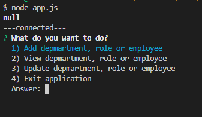

# Employee-Management-System

## Description

A simple application that allows the user to manage an employee database. 

Link to Github: [Employee-Management-System](https://github.com/toveson/Employee-Management-System)

## Table of Contents

* [User_Story](#User_Story)
* [Installation](#installation)
* [Usage](#usage)
* [Contributing](#contributing)
* [License](#license)
* [Questions](#questions)

## User_Story
As a business owner
I need a way to easily view departments, roles, and empolyees.

WHEN changes are needed I am able to make them.

## Installation

To install locally run `npm init` to install dependencies.

## Usage

Application is invoked with command: `node app.js`

## License

MIT License

Copyright (c) 2020 Trever Oveson

## Contributing

When contributing to this repository, please first discuss the change you wish to make via issue, email, or any other method with the owner(s) of this repository before making a change.

## Questions

For any questions the author(s) can be contacted at:

### Trever Oveson

GitHub: @[toveson](https://github.com/toveson)

Email: toveson9522@gmail.com